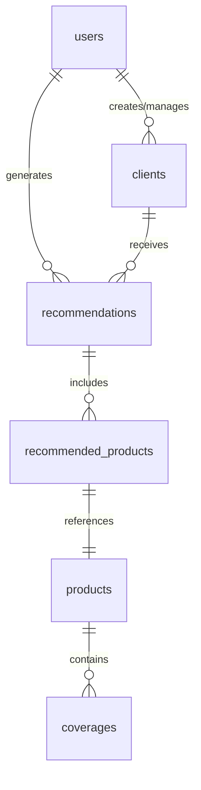

# Esquema Físico de Base de Datos — Coverly

## 1. Consideraciones Generales (PostgreSQL)

- **Identificadores (PKs):** Se utilizará el formato `UUID` (`uuid-ossp` o `pgcrypto` v4) en todas las tablas para garantizar la unicidad e imposibilitar la predicción de IDs.
- **Tipos de Datos Flexibles:** Ya que el motor necesita evaluar diferentes tipos de clientes y productos, se aprovechará `JSONB` de Postgres para estructuras condicionales (ej. `specificData` de un producto o `economicProfile`).
- **Control de Tiempos (Auditoría):** Toda tabla incluirá `created_at`, `updated_at` y, en su caso, `deleted_at` para soft-deletes.

## 2. Diagrama de Relaciones (Abstraído)

## 3. Tablas y Definición de Tipos

### `users` (Usuarios del Sistema)

Almacena al personal interno (Agentes, Supervisores, Admins).

| Columna | Tipo | Restricciones | Descripción |
| :--- | :--- | :--- | :--- |
| `id` | `UUID` | PK | Identificador único |
| `email` | `VARCHAR(255)` | UNIQUE, NOT NULL | Correo para login |
| `password_hash` | `VARCHAR(255)` | NOT NULL | Cifrado con bcrypt |
| `name` | `VARCHAR(150)` | NOT NULL | Nombre del empleado |
| `role` | `VARCHAR(50)` | NOT NULL | `AGENT`, `SUPERVISOR`, `ADMIN` |
| `is_active` | `BOOLEAN` | DEFAULT TRUE | Habilitar/Deshabilitar cuenta |
| `created_at` | `TIMESTAMP` | NOW() | Fecha de creación |
| `updated_at` | `TIMESTAMP` | NOW() | Última modificación |

### `clients` (Prospectos y Asegurados)

Toda la entidad se modela para absorber la validación del Motor Inteligente.

| Columna | Tipo | Restricciones | Descripción |
| :--- | :--- | :--- | :--- |
| `id` | `UUID` | PK | Identificador único |
| `agent_id` | `UUID` | FK (`users.id`) | Agente que registró/gestiona |
| `first_name` | `VARCHAR(100)` | NOT NULL | |
| `last_name` | `VARCHAR(100)` | NOT NULL | |
| `email` | `VARCHAR(255)` | UNIQUE | |
| `phone` | `VARCHAR(20)` | | |
| `date_of_birth` | `DATE` | NOT NULL | Para cálculo de edad (`age`) |
| `gender` | `VARCHAR(10)` | | `M`, `F`, `OTHER` |
| `client_type` | `VARCHAR(50)` | DEFAULT 'NEW' | `NEW`, `RECURRING` |
| `economic_profile` | `JSONB` | | `{ annualIncome, occupation, dependents }` |
| `risk_level` | `VARCHAR(50)` | | Elevado, Medio, Bajo |
| `needs` | `JSONB` | | Tipos de seguro buscados `["AUTO", "VIDA"]` |
| `created_at` | `TIMESTAMP` | NOW() | |

### `products` (Catálogo de Seguros)

| Columna | Tipo | Restricciones | Descripción |
| :--- | :--- | :--- | :--- |
| `id` | `UUID` | PK | |
| `name` | `VARCHAR(150)` | NOT NULL | Nombre comercial |
| `type` | `VARCHAR(50)` | NOT NULL | `AUTO`, `LIFE`, `FIRE`, `MOBILE` |
| `description` | `TEXT` | | |
| `price_base` | `DECIMAL(12,2)` | NOT NULL | |
| `is_active` | `BOOLEAN` | DEFAULT TRUE | |
| `specific_data` | `JSONB` | | Datos específicos de la vertical |

### `coverages` (Coberturas de Productos)

| Columna | Tipo | Restricciones | Descripción |
| :--- | :--- | :--- | :--- |
| `id` | `UUID` | PK | |
| `product_id` | `UUID` | FK (`products.id`) | |
| `name` | `VARCHAR(150)` | NOT NULL | Ej. "Robo Total" |
| `description` | `TEXT` | | |
| `value` | `DECIMAL(12,2)` | | Suma asegurada o porcentaje |

### `recommendations` (Historial / Motor)

Almacena el resultado y flujo de cada cotización o scoring.

| Columna | Tipo | Restricciones | Descripción |
| :--- | :--- | :--- | :--- |
| `id` | `UUID` | PK | |
| `client_id` | `UUID` | FK (`clients.id`) | |
| `agent_id` | `UUID` | FK (`users.id`) | |
| `status` | `VARCHAR(50)` | NOT NULL | `GENERATED`, `PRESENTED`, `ACCEPTED`, `REJECTED` |
| `global_score` | `DECIMAL(5,2)` | | Puntuación total 0 a 100 |
| `rejection_reason` | `VARCHAR(255)` | | Por qué se rechazó (si aplica) |
| `created_at` | `TIMESTAMP` | NOW() | |

### `recommended_products` (Unión de Productos Recomendados)

| Columna | Tipo | Restricciones | Descripción |
| :--- | :--- | :--- | :--- |
| `recommendation_id` | `UUID` | FK (`recommendations.id`) | |
| `product_id` | `UUID` | FK (`products.id`) | |
| `match_score` | `DECIMAL(5,2)` | | Qué tanto fit hace |
| `final_price` | `DECIMAL(12,2)` | | Precio con descuento o recargos |
| `justifications` | `JSONB` | | Arreglo de strings con los Insights de la IA |

## 4. Estrategia de Índices

Para garantizar el rendimiento de lectura de la API:

1. `idx_clients_agent`: Índice en `clients.agent_id` para listar rápidamente el dashboard del agente.
2. `idx_products_type_active`: Índice compuesto en `products(type, is_active)` para listar catálogos instantáneamente por categoría.
3. Índice GIN sobre `clients.economic_profile` en caso de hacer búsquedas de analítica predictiva cruzada en iteraciones futuras.
